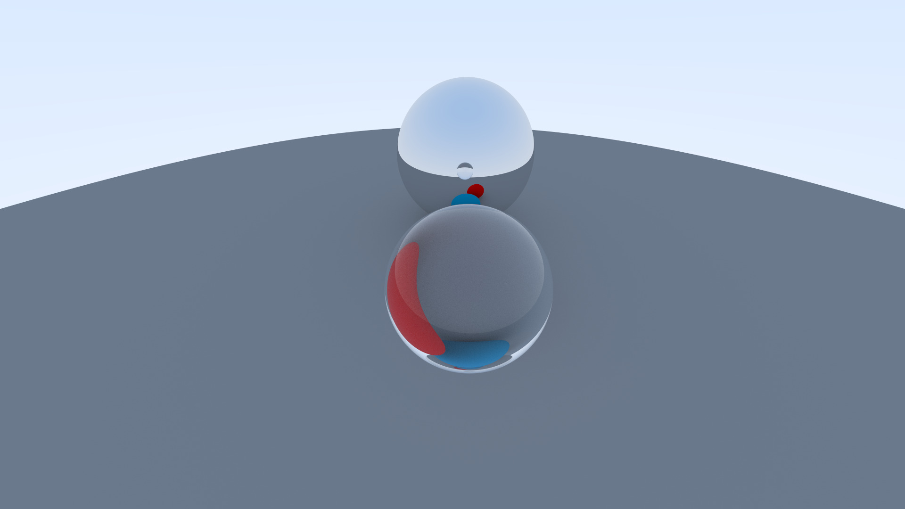
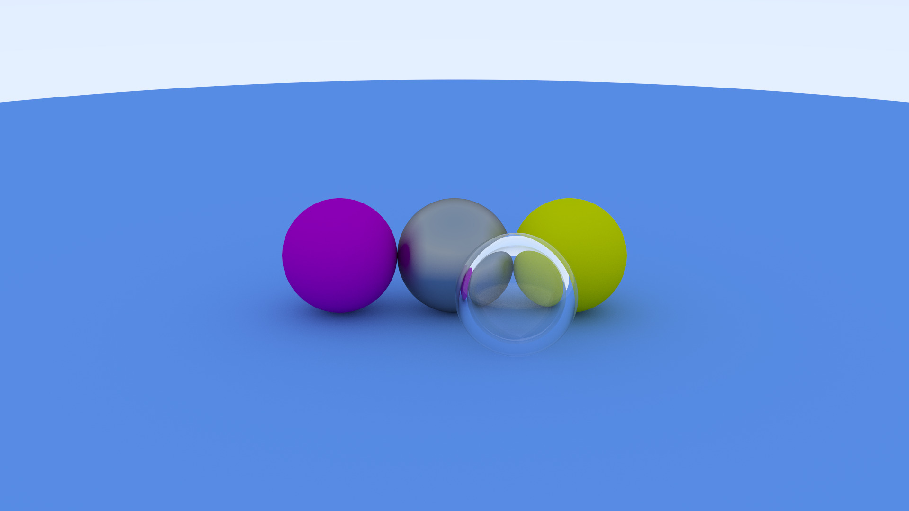
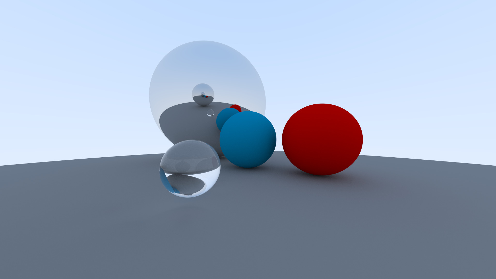

# Raytracer Basico
Raytracer simples feito a fim de estudos

## Recursos
- Superficies lambertiânas, materiais metálicos e dielétricos
- Intersecção de esferas
- Refração e reflexão total em dielétricos
- Movimentação da câmera e ponto o qual ela mira
- Fov vertical variável

## Exemplos
> **Obs.:** todos os exemplos são renderizados em 1080p com 1000 samples por pixel e um limite de 50 bounces






## Como compilar
```sh
make raytracer && ./raytracer > image.ppm
```
