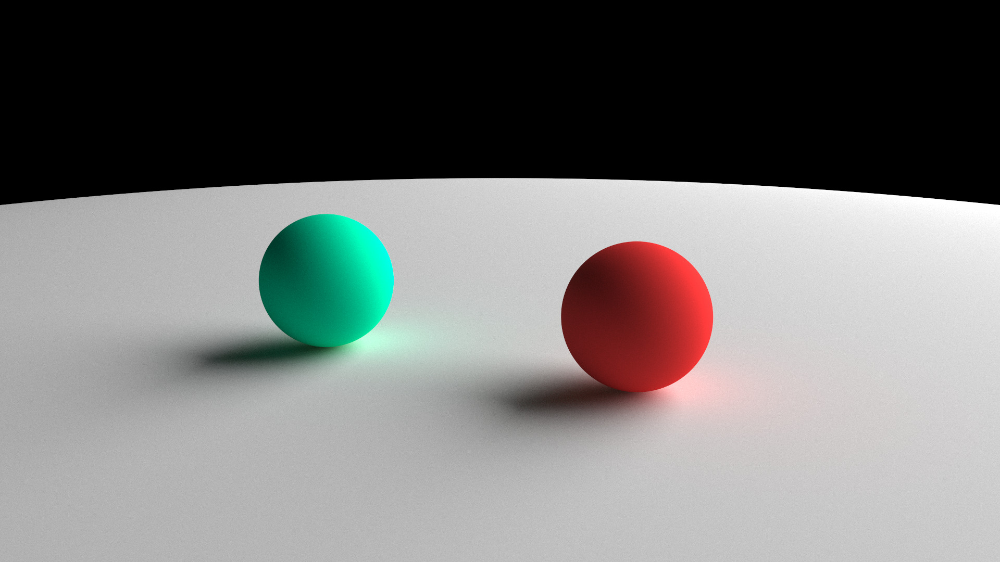

# Basic Raytracer

Português: [README.pt-br.md](README.pt-br.md)

Simple raytracer written in C made with the purpose of studying

## Features
- Lambertian surfaces, metalic and dielectric materials
- Sphere intersection
- Refraction and total internal reflection in dielectrics
- Changeable camera position and target point
- Changeable vertical fov

## Exemples





## How to compile
```sh
make raytracer && ./raytracer > image.ppm
```

## References
[Ray tracing in one weekend](https://raytracing.github.io/books/RayTracingInOneWeekend.html): a guide to writting your own basic raytracer that presented most of the logic used in this project
