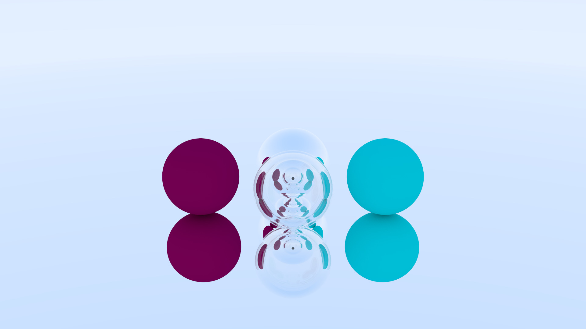

# Basic Raytracer

Português: [README.pt-br.md](README.pt-br.md)

Simple raytracer made with the purpose of studying

## Features
- Lambertian surfaces, metalic and dielectric materials
- Sphere intersection
- Refraction and total internal reflection in dielectrics
- Changeable camera position and target point
- Changeable vertical fov

## Exemples
> **Obs.:** all examples are rendered in 1080p with 1000 samples per pixel and a limit of 50 bounces




## How to compile
```sh
make raytracer && ./raytracer > image.ppm
```
